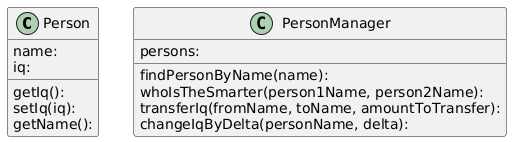

### Abstract Factory

<details>

```
@startuml

top to bottom direction
skinparam linetype ortho

class DatabasePersonRepository {
   __construct(connection): 
   connection: 
   readPeople(): 
   savePerson(person): 
   readPerson(name): 
}
class DatabasePersonRepositoryFactory {
   __construct(connection): 
   connection: 
   createRepository(): 
}
class FilePersonRepository {
   __construct(filePath): 
   filePath: 
   readPeople(): 
   savePerson(person): 
   readPerson(name): 
}
class FilePersonRepositoryFactory {
   createRepository(): 
}
class Person {
   __construct(name, age): 
   name: 
   age: 
   getAge(): 
   getName(): 
}
class PersonRepository {
   readPeople(): 
   savePerson(person): 
   readPerson(name): 
}
class PersonRepositoryFactory {
   createRepository(): 
}

DatabasePersonRepository         -[#008200,dashed]-^  PersonRepository                
DatabasePersonRepositoryFactory  -[#008200,dashed]-^  PersonRepositoryFactory         
FilePersonRepository             -[#008200,dashed]-^  PersonRepository                
FilePersonRepositoryFactory      -[#008200,dashed]-^  PersonRepositoryFactory
@enduml
```

</details>


### Adapter

<details>

```
@startuml
top to bottom direction
skinparam linetype ortho

class ASCIIStackInterface {
   push(char): 
   pop(): 
}
class IntegerStack {
   stack: 
   push(integer): 
   pop(): 
}
class IntegerStackAdapter {
   integerStack: 
   push(char): 
   pop(): 
}
class IntegerStackInterface {
   push(integer): 
   pop(): 
}

IntegerStack           -[#008200,dashed]-^  IntegerStackInterface 
IntegerStackAdapter    -[#008200,dashed]-^  ASCIIStackInterface
@enduml
```

</details>


### Observer

<details>

```
@startuml
top to bottom direction
skinparam linetype ortho

class FileScanner {
   observers: 
   scan(filePath): 
   registerObserver(observer): 
   notifyObservers(word): 
}
class LongestWordKeeper {
   longestWord: 
   update(word): 
   getLongestWord(): 
}
class NumberCounter {
   count: 
   update(word): 
   getCount(): 
}
class ObserverInterface {
   update(word): 
}
class ReverseWord {
   update(word): 
}
class WordCounter {
   count: 
   update(word): 
   getCount(): 
}

LongestWordKeeper  -[#008200,dashed]-^  ObserverInterface 
NumberCounter      -[#008200,dashed]-^  ObserverInterface 
ReverseWord        -[#008200,dashed]-^  ObserverInterface 
WordCounter        -[#008200,dashed]-^  ObserverInterface
@enduml
```

</details>


### Facade

<details>

```
@startuml
top to bottom direction
skinparam linetype ortho

class Person {
   name: 
   iq: 
   getIq(): 
   setIq(iq): 
   getName(): 
}
class PersonManager {
   persons: 
   findPersonByName(name): 
   whoIsTheSmarter(person1Name, person2Name): 
   transferIq(fromName, toName, amountToTransfer): 
   changeIqByDelta(personName, delta): 
}
@enduml
```

</details>



### Composite

<details>

```
@startuml
top to bottom direction
skinparam linetype ortho

class Directory {
   contents: 
   name: 
   listContent(): 
   getSize(): 
   remove(fsEntity): 
   add(fsEntity): 
   getName(): 
}
class File {
   size: 
   name: 
   getSize(): 
   getName(): 
}
class FileSystemEntity {
   getSize(): 
   getName(): 
}

Directory         -[#008200,dashed]-^  FileSystemEntity 
File              -[#008200,dashed]-^  FileSystemEntity
@enduml
```

</details>


### Proxy

<details>

```
@startuml
!theme plain
top to bottom direction
skinparam linetype ortho

class CachedPersonRepository {
   cache: 
   repository: 
   readPeople(): 
   savePerson(person): 
   readPerson(name): 
}
class InMemoryPersonRepository {
   people: 
   readPeople(): 
   savePerson(person): 
   readPerson(name): 
}
class Person {
   name: 
   iq: 
   getIq(): 
   getName(): 
}
class PersonRepository {
   readPeople(): 
   savePerson(person): 
   readPerson(name): 
}

CachedPersonRepository    -[#008200,dashed]-^  PersonRepository         
InMemoryPersonRepository  -[#008200,dashed]-^  PersonRepository
@enduml
```

</details>


### Singleton

<details>

```
@startuml
top to bottom direction
skinparam linetype ortho

class Superman {
   instance: 
   getInstance(): 
   sayHello(): 
}
@enduml
```

</details>


### Iterator

<details>

```
@startuml
top to bottom direction
skinparam linetype ortho

class FileStringCollection {
   filePath: 
   getIterator(): 
}
class FileStringIterator {
   fileHandle: 
   nextLine: 
   getNext(): 
   readNextLine(): 
   hasNext(): 
   __destruct(): 
}
class InMemoryStringCollection {
   strings: 
   getIterator(): 
}
class InMemoryStringIterator {
   strings: 
   position: 
   getNext(): 
   hasNext(): 
}
class StringCollection {
   getIterator(): 
}
class StringIterator {
   getNext(): 
   hasNext(): 
}

FileStringCollection      -[#008200,dashed]-^  StringCollection         
FileStringIterator        -[#008200,dashed]-^  StringIterator           
InMemoryStringCollection  -[#008200,dashed]-^  StringCollection         
InMemoryStringIterator    -[#008200,dashed]-^  StringIterator
@enduml
```

</details>


### Decorator

<details>

```
@startuml
top to bottom direction
skinparam linetype ortho

class InMemoryPersonRepository {
   people: 
   readPeople(): 
   savePerson(person): 
   readPerson(name): 
}
class LowerCaseReadPersonDecorator {
   wrapped: 
   readPeople(): 
   savePerson(person): 
   readPerson(name): 
}
class Person {
   name: 
   iq: 
   getIq(): 
   setName(name): 
   getName(): 
}
class PersonRepository {
   readPeople(): 
   savePerson(person): 
   readPerson(name): 
}
class UppercaseWritePersonDecorator {
   wrapped: 
   readPeople(): 
   savePerson(person): 
   readPerson(name): 
}

InMemoryPersonRepository       -[#008200,dashed]-^  PersonRepository              
LowerCaseReadPersonDecorator   -[#008200,dashed]-^  PersonRepository              
UppercaseWritePersonDecorator  -[#008200,dashed]-^  PersonRepository
@enduml
```

</details>


### Visitor

<details>

```
@startuml
top to bottom direction
skinparam linetype ortho

class AverageSalaryReport {
   totalSalary: 
   employeeCount: 
   visitEmployee(employee): 
   visitCompany(company): 
}
class Company {
   name: 
   employees: 
   addEmployee(employee): 
   accept(visitor): 
   getEmployees(): 
   getName(): 
}
class CompanyReportVisitor {
   visitEmployee(employee): 
   visitCompany(company): 
}
class Employee {
   name: 
   salary: 
   department: 
   getSalary(): 
   getDepartment(): 
   accept(visitor): 
   getName(): 
}
class NumberOfEmployeesPerDepartmentReport {
   departmentCount: 
   visitEmployee(employee): 
   visitCompany(company): 
}
class TotalNumberOfEmployeesReport {
   employeeCount: 
   visitEmployee(employee): 
   visitCompany(company): 
}
class TotalSalaryReport {
   totalSalary: 
   visitEmployee(employee): 
   visitCompany(company): 
}

AverageSalaryReport                   -[#008200,dashed]-^  CompanyReportVisitor                 
NumberOfEmployeesPerDepartmentReport  -[#008200,dashed]-^  CompanyReportVisitor                 
TotalNumberOfEmployeesReport          -[#008200,dashed]-^  CompanyReportVisitor                 
TotalSalaryReport                     -[#008200,dashed]-^  CompanyReportVisitor
@enduml
```

</details>


### Strategy

<details>

```
@startuml
top to bottom direction
skinparam linetype ortho

class ComparisonStrategy {
   compare(a, b): 
}
class DepartmentAscStrategy {
   compare(a, b): 
}
class DepartmentDescStrategy {
   compare(a, b): 
}
class Employee {
   name: 
   salary: 
   department: 
   getSalary(): 
   getDepartment(): 
   getName(): 
}
class EmployeeCollection {
   employees: 
   addEmployee(employee): 
   getEmployees(): 
   sort(strategy): 
}
class NameAscStrategy {
   compare(a, b): 
}
class NameDescStrategy {
   compare(a, b): 
}
class SalaryAscStrategy {
   compare(a, b): 
}
class SalaryDescStrategy {
   compare(a, b): 
}

DepartmentAscStrategy   -[#008200,dashed]-^  ComparisonStrategy     
DepartmentDescStrategy  -[#008200,dashed]-^  ComparisonStrategy     
NameAscStrategy         -[#008200,dashed]-^  ComparisonStrategy     
NameDescStrategy        -[#008200,dashed]-^  ComparisonStrategy     
SalaryAscStrategy       -[#008200,dashed]-^  ComparisonStrategy     
SalaryDescStrategy      -[#008200,dashed]-^  ComparisonStrategy
@enduml
```

</details>


